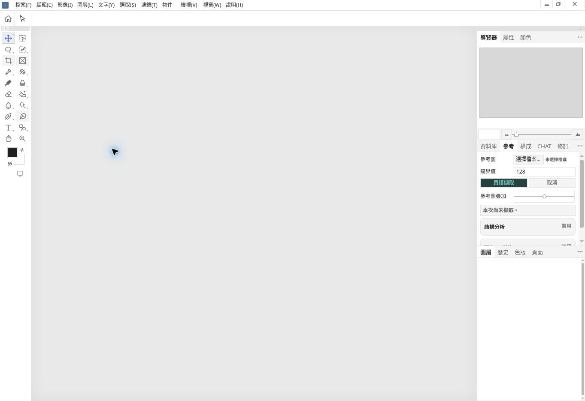
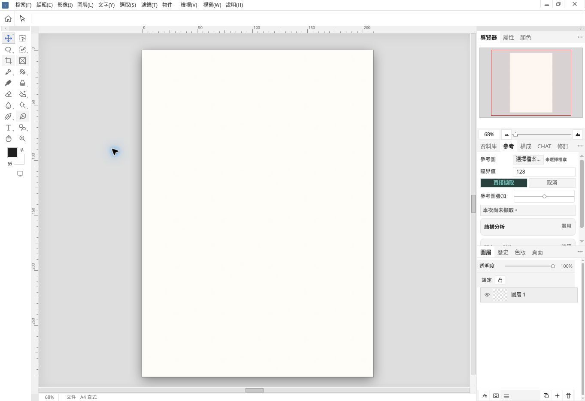
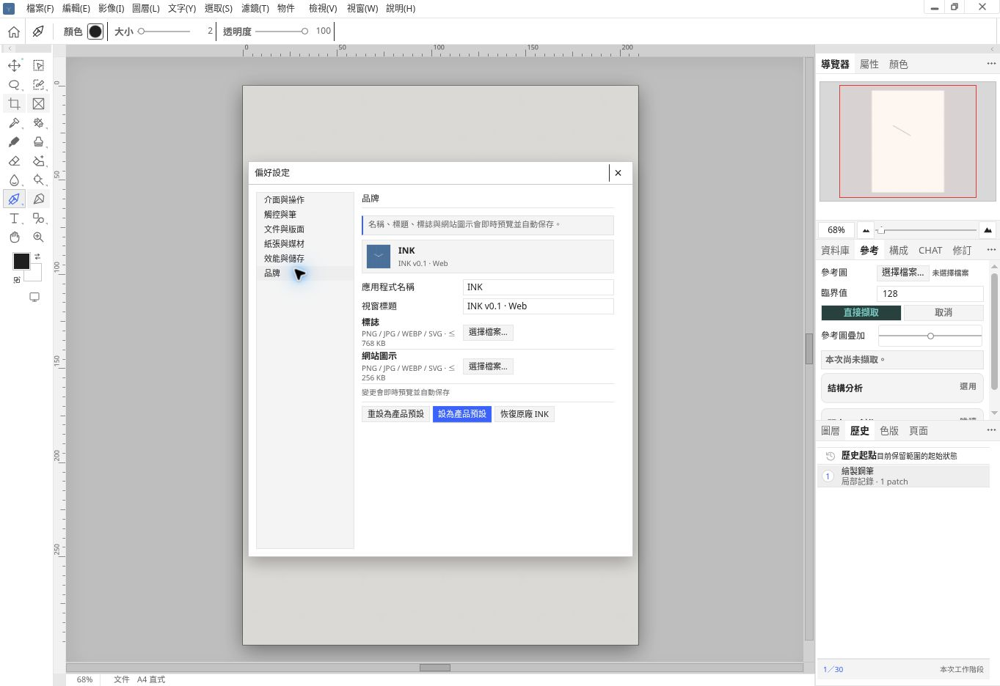

# INK UI repair result — 2026-10-01
STATUS: SOURCE_PUBLISHED / ISOLATED_RENDERED_REVIEW_VERIFIED / CACHED_OFFICIAL_SESSION_PENDING
USER explicitly requested repairing discussed/found issues before Photoshop modular-system research. No Actions, terminal Runtime, agents, format migration, or multi-document implementation.

## Identity and evidence
Baseline: 0947e7e5b29dfdf8520e0e58b5015c7b1037e0c5.
Final product source: 08180aa001463ea623a4ad45c9aab5d0dd0be509.
Preview: https://thedoorw.github.io/INK-Browser-QA/qa/evidence/ink-ui-repair-20261001/preview.html?fresh
Preview is generated shared Web shell with a base URL pointing to product/source; outside the editor service-worker scope. It is not proof that the original cached official session runs the new build. Observed stylesheet is repair3; not a complete transitive browser-loaded hash attestation.
Review is informed delta review, not independent blind review. Prior references at stale scratch paths were unavailable; no pixel-perfect PS claim.

## Repairs and actual checks
- Workspace: no document → empty neutral workspace, no drawable stage/rulers/document status; Navigator zoom controls disabled. New → native finite A4 page, fit 68%, paper-bounded Navigator, ruler zero at page top-left with outside labels suppressed. Native layout transform remains authoritative; no second document/schema.
- New defaults hide safe-area/center overlays; saved documents retain their flags. Pointer/keyboard document operations guarded in empty state. Import/open activate document presence through existing pathways.
- Menu and options strip now both computed rgb(255,255,255); removed effective legacy conflicting rules.
- Preferences: six categories populated using original live controls: interface/interaction, touch/pen, document/layout, paper/media, performance/storage, branding. All six visited; original IDs/handlers retained. Summary light #f4f4f4 / text #222; grid justify-content:start. Branding three action buttons y=554.03125, height=22, margin=0. Actual inner dialog width525 at viewport1363×936 (backdrop1021 is not dialog width); responsive max constraint740. No invented deferred OK/Cancel semantics.
- SVG viewBox/wrappers and shared icon stroke normalized; quick-selection silhouette corrected. All tool/flyout states and PS outline equivalence remain unverified.
- Edit has one adjustment entry; Object distortion name translated without command change. Color panel internal implementation prose removed, native color controls retained.
- UIR-01 corrected: INK footer filter is actual image-effect filterStack, not Photoshop layer-search/type filter. Previous move recommendation withdrawn; no fake search/blend feature added.
- Draw → History 1/30; Ctrl+Z → start 0/30; Ctrl+Shift+Z → drawing 1/30 observed in final preview. Native artboard-output tests 8/8 and SW ownership test1/1 passed.
- Shell generator check, JS syntax, generated Web/Portable normalized parity, duplicate-ID/adjustment checks, git diff whitespace passed. Existing shared-shell tests retain 3 failures also reproduced unchanged on baseline (stale v0.1 URLs/retired contextualAdvancedBtn). Older foundation assumptions also fail baseline; no blanket QA PASS.
- CSS !important count122→116; no new !important or breakpoint family. Existing overall CSS technical debt remains.

## Evidence

## Open boundaries
No multi-document tabs, close-document lifecycle, new document-size dialog, full open/save/reload/restore coverage, complete high-zoom/rotated Navigator interaction, all tool/panel/disabled/focus states, Portable rendered coverage or full PS pixel fidelity closure. Other sparse capability panels (CHAT/database etc.) need capability/content decisions; no filler added.
Photoshop modular-system research is next, not claimed completed.
Automatic approval review rejected clicking official session “啟用更新”, treating it as a persistent app-state change without explicit activation authorization. No bypass performed; that session's new-build verification remains pending.
